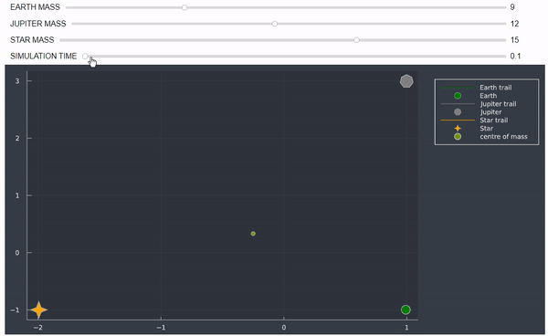

# Three-Body-Problem
Three body problem simulation in Julia.

Sundials.jl used to solve differential equations.

Interact.jl to manipulate with simulation. (mass and time sliders and optionally init positions)

Here example results:

